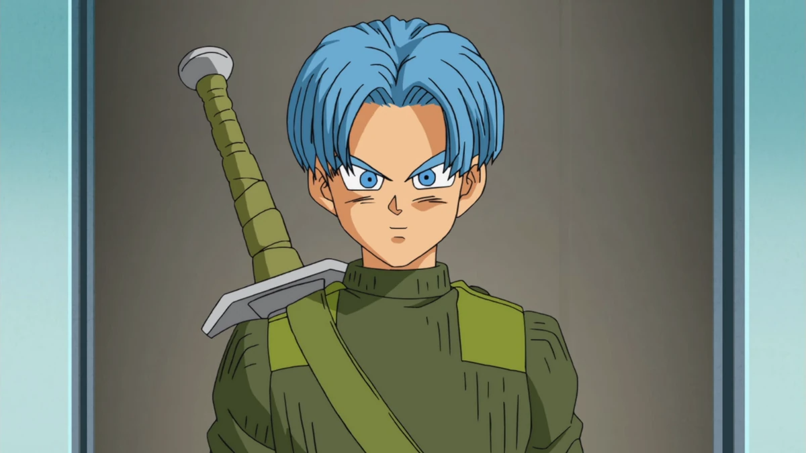

# Trunks

## Overview
Trunks is a prominent character in the **Dragon Ball Super** series and is the son of Vegeta and Bulma. He is known for his adventurous spirit, strong sense of justice, and close bond with his friends, especially Goten.

## Character Profile

- **Full Name:** Trunks Brief
- **Race:** Half-Saiyan
- **Occupation:** Student, fighter

## Appearance
Trunks has blue hair, a signature trait of his mother, and often wears a variety of outfits, including his iconic Capsule Corporation jacket. He has a youthful, energetic appearance, reflecting his personality.

## Personality
Trunks is brave, loyal, and often displays a mix of confidence and naivety typical of children. He is serious about training and protecting his friends but also enjoys having fun and playing pranks with Goten. 

## Abilities
Trunks possesses several impressive abilities for his age, including:

- **Super Saiyan Transformation:** Can transform into a Super Saiyan, enhancing his strength and speed.
- **Energy Blasts:** Proficient in using ki blasts in battle.
- **Swordsmanship:** Skilled with a sword, particularly in his future timeline.
- **Fusion:** Can perform the Fusion Dance with Goten to become Gotenks.

## Notable Story Arcs
- **Battle of Gods Arc:** Trunks witnesses the arrival of Beerus and the chaos that follows.
- **Resurrection 'F' Arc:** Participates in the battle against Frieza’s forces.
- **Universe 6 Saga:** He helps out in the tournament against Universe 6.
- **Future Trunks Saga:** In this arc, the older Trunks from the future plays a key role, impacting Trunks’ growth.

## Relationships

- ### **[Goten](goten.md)** his best friend 
- ### **[Vegeta](vegeta.md)** his dad
- ### **[Bra/Bulla](bra.md)** his younger sister

##

### Back to **[Main](mainfile.md)**