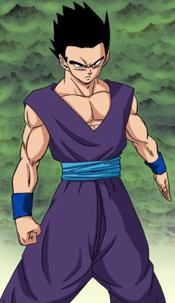
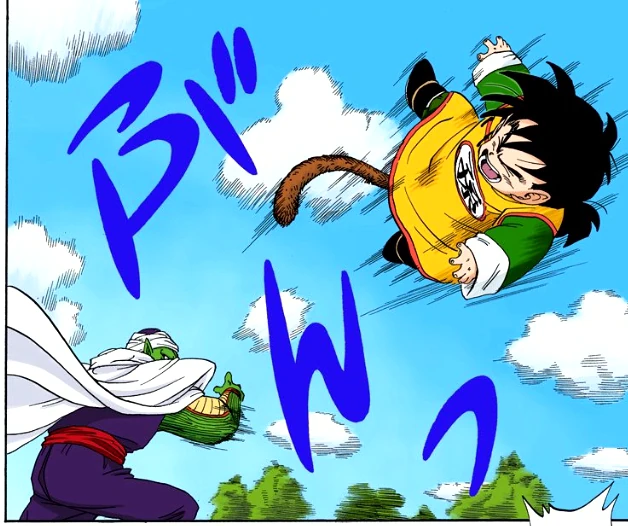

# Gohan: The Scholar Warrior

  
  
  Gohan is the eldest son of **[Goku](goku.md)** and **Chi-Chi**, and he stands out as one of the most unique characters in the *Dragon Ball* series. Born with extraordinary potential, Gohan is initially characterized by his gentle nature and academic prowess, much to the chagrin of his battle-loving father.

## Early Life

From a young age, Gohan exhibited remarkable strength and abilities, but he often preferred books over battles. His childhood was marked by intense training sessions with his father and the guidance of his mentor, **Piccolo**. It was during the **Cell Saga** that Gohan truly came into his own, tapping into his hidden power to become the first to achieve the **Super Saiyan 2** transformation.

## The Ultimate Fighter

Gohan’s transformation during the Cell Games not only saved the Earth but also showcased his inner strength and determination. However, after this peak moment, he shifted his focus toward academics, becoming a scholar and later earning a Ph.D.

 
## Legacy

Despite his more peaceful life, Gohan is always ready to defend his loved ones. His dual identity as a scholar and a warrior makes him a compelling character, balancing intellect with incredible power.

### Fun Fact

Gohan's potential is so vast that he is often referred to as the "Chosen One," and many fans believe he could have surpassed even his father in strength!

## Pan: The Future Warrior

**[Pan](pan.md)**, the daughter of Gohan and **Videl**, is a spirited young girl who embodies the best traits of her family. Born with Saiyan blood, she shows immense potential from a young age.

---

In essence, Gohan embodies the struggle between peace and power, making him a beloved figure in the *Dragon Ball* universe.

### Back to **[Main](mainfile.md)**

