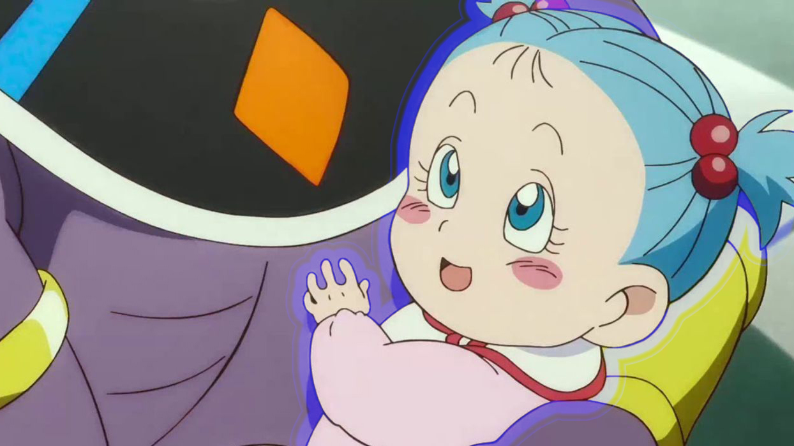

# Bra

## Overview
Bra, also known as Bulla in the English dub, is a character in the **Dragon Ball Super** series. She is the daughter of Vegeta and Bulma and is known for her strong-willed personality and connection to both her Saiyan and human heritage.

## Character Profile

- **Full Name:** Bra Brief
- **Race:** Half-Saiyan
- **Occupation:** Student, aspiring fighter
- **Affiliation:** Capsule Corporation, Z Fighters (potentially)
- **First Appearance:** Dragon Ball Z, Episode 277 (but more prominently in Dragon Ball Super)

## Appearance
Bra has long, blue hair like her mother, Bulma, and often wears fashionable clothing. Her style is modern and chic, reflecting her upbringing in the wealthy Brief family. She is usually seen in casual outfits, sometimes with a touch of Saiyan battle gear.

## Personality
Bra is confident, spirited, and has a strong sense of independence. Unlike her father, Vegeta, she is more easygoing and often shows a playful side. She is determined and aims to become a skilled fighter, though she also values her social life and friendships.

## Abilities
While her full potential as a fighter is not extensively explored in the series, Bra exhibits several abilities, including:

- **Half-Saiyan Strength:** Inherits strength and agility from her Saiyan lineage.
- **Potential for Super Saiyan Transformation:** As a half-Saiyan, she has the potential to achieve the Super Saiyan form.

## Notable Story Arcs
- **Dragon Ball Super:** Although Bra's role is minimal in terms of battles, she is present during key family moments and showcases her character development alongside her parents and brother, Trunks.

## Relationships

- ### **[Trunks](Trunks.md)** her older brother
- ### **[Vegeta](vegeta.md)** her dad

##

### Back to **[Main](mainfile.md)**