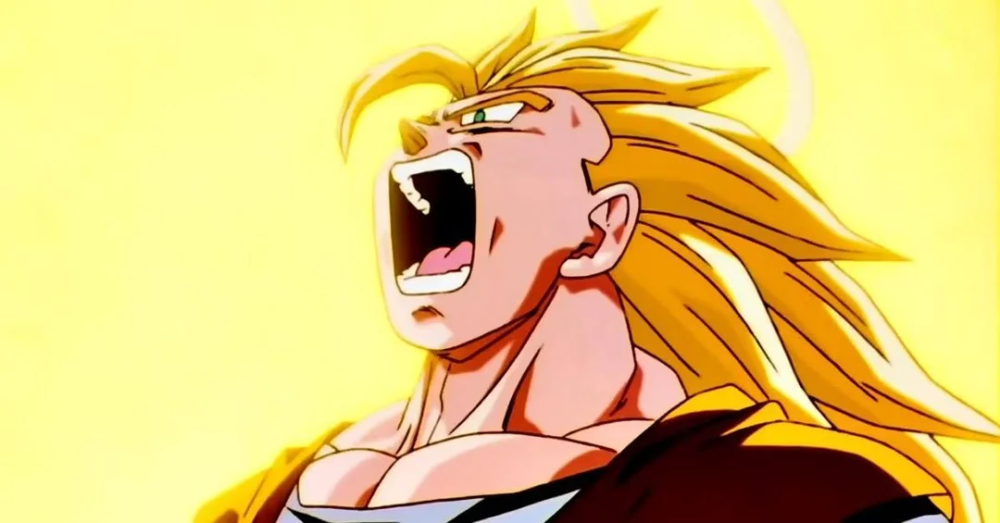
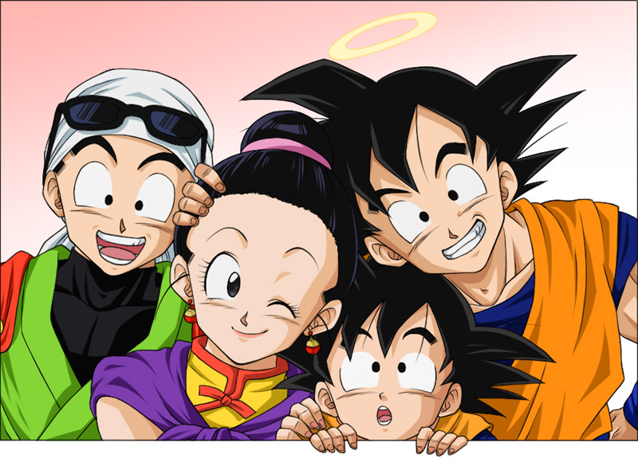

# Goku

**Goku**, originally known as **Kakarot**, is the main protagonist of the *Dragon Ball* series and one of the most recognizable characters in anime history. His journey from a young boy with a monkey tail to the universe's most powerful warrior is a tale of growth, friendship, and unyielding determination.

## Early Life

Goku was sent to Earth as a baby from the planet **[Vegeta](vegeta.md)**, where he was raised by **Grandpa Gohan**. After a head injury, he lost his original mission to conquer Earth and instead grew up as a kind-hearted, carefree child. His love for fighting and adventure set him on a path that would change the universe forever.

## The Martial Arts Journey

Goku’s martial arts journey begins with training under **Master Roshi**, where he hones his skills and learns the Kamehameha wave. Throughout his life, Goku faces formidable foes, such as **Frieza**, **Cell**, and **Majin Buu**, constantly pushing his limits and transforming into stronger forms, including various **Super Saiyan** transformations.

## A Hero's Heart

Goku is defined by his unwavering sense of justice, compassion, and love for his friends and family. He values strong competition and often seeks out powerful opponents to challenge himself, embodying the spirit of a true warrior. His relationships with other characters, like **Vegeta**, **Piccolo**, and his family, highlight his growth as both a fighter and a person.

### Fun Fact

Goku’s insatiable appetite is legendary, often leading to humorous moments in the series, showcasing his simple yet endearing personality!

---

## The Legacy of Goku

Goku’s influence extends beyond his battles. As a father to **[Gohan](gohan.md)** and **[Goten](goten.md)**, he passes on his Saiyan pride and fighting spirit to the next generation. His legacy continues to inspire characters and fans alike, making him a central figure in the *Dragon Ball* universe.

### The Ultimate Warrior

Goku’s transformation into **Ultra Instinct**, a state of heightened reflexes and speed, represents the pinnacle of his abilities, marking him as one of the strongest beings in the multiverse.

---

### Back to **[Main](mainfile.md)**

