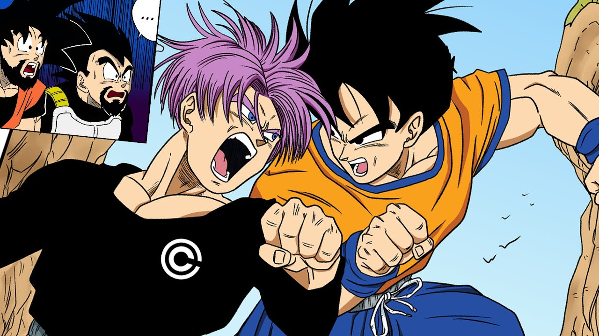

# Goten: The Young Saiyan

**Goten** is the second son of **[Goku](goku.md)** and **Chi-Chi**, and he brings a youthful charm and playful spirit to the *Dragon Ball* universe. Born shortly after the defeat of Majin Buu, Goten is often seen as the more carefree sibling compared to his older brother, **[Gohan](gohan.md)**.

## Early Life

From a young age, Goten exhibited extraordinary power, even rivaling that of Gohan at the same age. He shares a close bond with his best friend, **[Trunks](Vegeta/Trunks.md)**, the son of **[Vegeta](Vegeta/vegeta.md)** and **Bulma**, and together they embark on various adventures, often training to become stronger.

## Super Saiyan Transformation

Goten’s most notable achievement is his ability to transform into a **Super Saiyan** at a remarkably young age, showcasing the legendary Saiyan talent that runs in his bloodline. His transformation symbolizes both the power and potential of the new generation of fighters.

## A Joyful Spirit

Unlike his brother, Goten embraces a more carefree and fun-loving attitude, often getting into mischief but also displaying immense bravery when it matters most. He dreams of becoming a great warrior like his father and often trains hard alongside Trunks to achieve that goal.

### Fun Fact

Goten’s resemblance to his father, Goku, is striking, especially in his carefree smile and spiky hair, making him a beloved character among fans!

---

## Gotenks: The Fusion

One of Goten's most exciting aspects is his ability to perform the **Fusion Dance** with Trunks, creating the powerful warrior **Gotenks**. This fusion showcases their combined strengths and introduces a comedic yet formidable character into the *Dragon Ball* lore.

### Back to **[Main](mainfile.md)**

