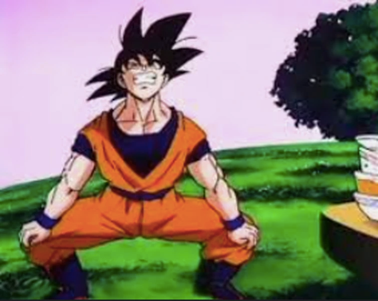
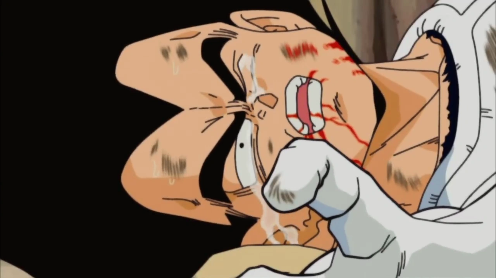
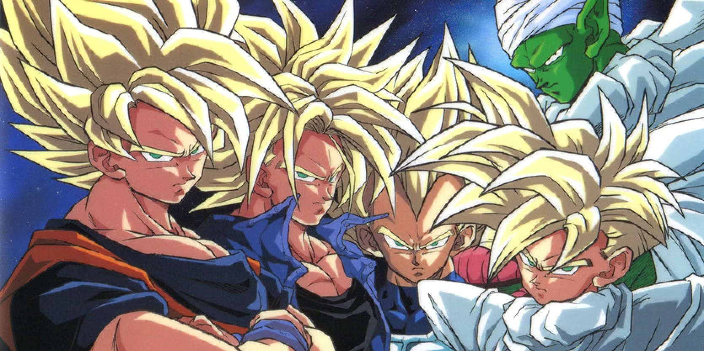

# [Goku](Goku/goku.md)

### **Goku**, originally known as **Kakarot**, is the main protagonist of the *Dragon Ball* series and one of the most iconic characters in anime history. A Saiyan warrior raised on Earth, Goku embodies the spirit of adventure, friendship, and relentless determination. Throughout his journey, he transforms from a naive boy into a powerful fighter, achieving numerous Super Saiyan forms and mastering advanced techniques like **Ultra Instinct**. Known for his insatiable appetite and cheerful demeanor, Goku is not only a formidable hero but also a loving father and friend, inspiring generations with his unyielding quest for strength and justice.

# [Vegeta](Vegeta/vegeta.md)

### **Vegeta**, the proud prince of the Saiyan race, is a central character in the *Dragon Ball* series known for his fierce rivalry with **Goku**. Initially introduced as a ruthless antagonist, Vegeta undergoes significant character development, evolving from a cold-hearted warrior into a complex hero. His relentless pursuit of power drives him to achieve various forms, including **Super Saiyan Blue** and beyond, as he strives to surpass Goku. With his sharp wit, intense pride, and commitment to protecting his family, Vegeta embodies the essence of a warrior, making him a fan-favorite and an essential part of the *Dragon Ball* saga.

# [DBZ Power ranks](PwrRanks/rank.md)

### The *Dragon Ball Z* kids—**Gohan**, **Goten**, **Trunks**, **Bra**, and **Pan**—represent the future of the Saiyan legacy, each with unique abilities and potential. **Gohan**, ranked highest, is known for his immense latent power, achieving forms like **Super Saiyan 2** and **Ultimate Gohan**. **Trunks**, the son of Vegeta and Bulma, showcases remarkable strength with transformations like **Super Saiyan Rage**. **Goten**, Goku's younger son, can also transform into **Super Saiyan** and excels in the **Fusion Dance** with Trunks, becoming the powerful **Gotenks**. **Bra (Bulla)**, though still young, inherits strong potential from her Saiyan lineage, while **Pan**, the daughter of Gohan and Videl, demonstrates agility and fighting skills, training under her grandfather, Goku. Together, they blend their powerful heritage with their unique personalities, setting the stage for future adventures in the *Dragon Ball* universe.

