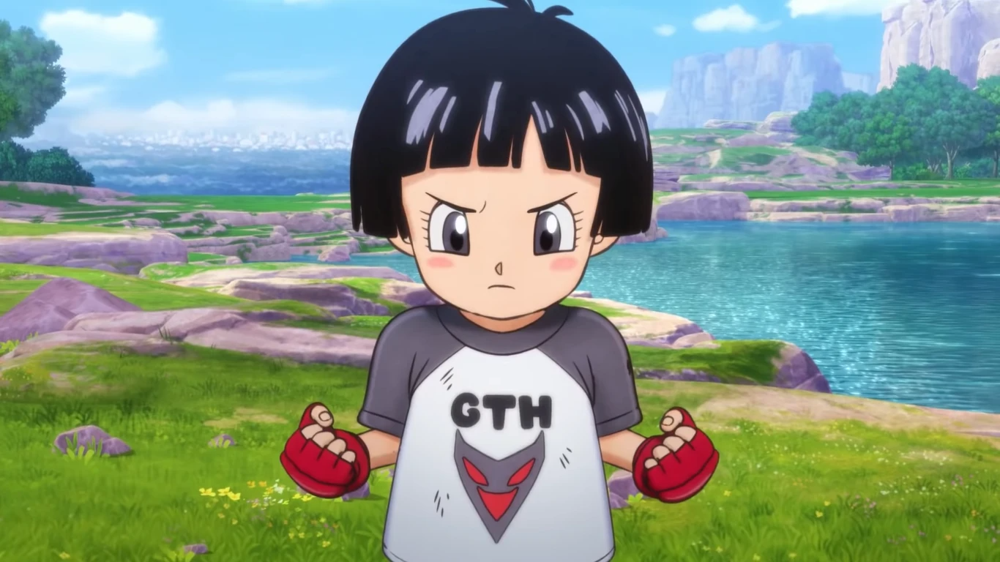
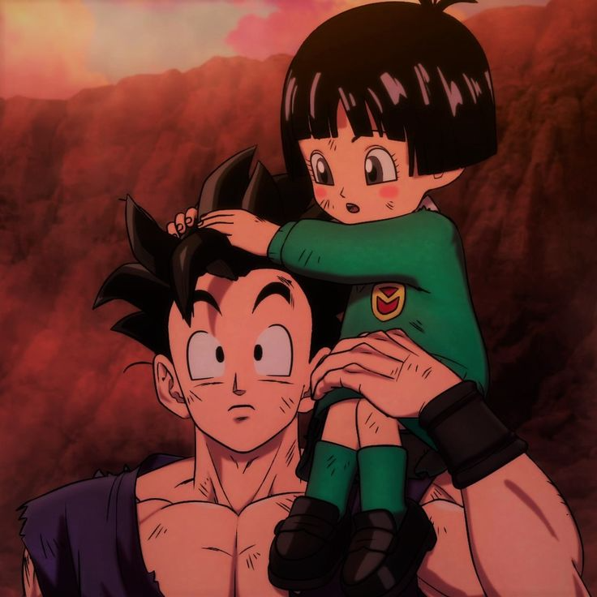

# Pan: The Spirited Warrior

**Pan** is the daughter of **[Gohan](gohan.md)** and **Videl**, and she represents the new generation of warriors in the *Dragon Ball* universe. With a mix of Saiyan blood and strong human spirit, Pan is poised to become a formidable fighter while also embracing her adventurous nature.

## Early Life

Born shortly after the defeat of **Majin Buu**, Pan was raised in a loving household where strength and intellect were valued. She shares a close bond with her grandfather, **Goku**, who inspires her to be strong and brave. From a young age, Pan showcases her potential, demonstrating impressive strength and agility.

## A Young Fighter

Pan’s training begins early, often under the watchful eye of her family. Although she’s still a child, she shows remarkable skill and determination, proving that she inherits the fighting spirit of the Saiyan lineage. Her adventures often involve participating in martial arts tournaments and training with her father.

## The Next Generation

As Pan grows, she embodies the hopes of the next generation of warriors. Her character introduces a fresh dynamic to the *Dragon Ball* narrative, showcasing a blend of Saiyan strength and human qualities. With a spirited personality and fierce determination, she is a character to watch as the series progresses.

### Fun Fact

Pan is known for her fiery attitude and strong will, often getting into amusing situations that highlight her youthful exuberance. Her connection to both Goku and Videl makes her a unique blend of warrior and scholar!

---

## A Bright Future

With the potential to become one of the strongest fighters in the series, Pan is destined to leave her mark on the *Dragon Ball* universe. Her relationships with her family and friends provide depth to her character, making her a beloved figure among fans.

---

In summary, Pan is not just Gohan and Videl's daughter; she is a symbol of hope for the future, carrying forward the legacy of the Saiyan lineage with her own unique flair.

### Back to **[Main](mainfile.md)**

