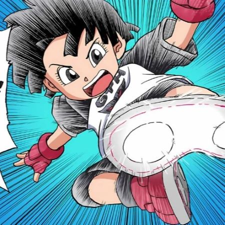
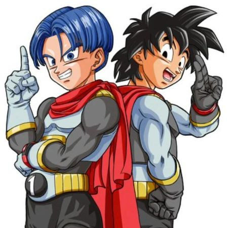
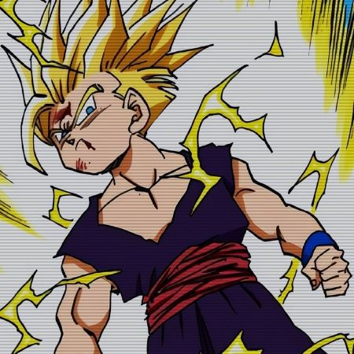

# Ranking the kids in Dragon Ball from Weakest to Strongest

### Introduction
Whether you've already read about the kids through our other pages, or you're looking at this page first, it's really cool to think about each kid and how strong they are. That being said, ranking them would be a cool way to display what they're capable of.

## Ranking Criteria
- Power
- Latent Potential
- Intelligence 

## Ranking

### 1. **Bra/Bulla**👶

- **Description:** The most recent child of Vegeta and Bulma's, still just a baby as of now. Hasn't really done any training (obviously), and isn't shown to be very interested in anything besdies well, just being a baby. Power is unknown, but power was never really shown in the first place.

- **Notable Feats:** None

##
### 2. **Pan**🦸‍♀️

- **Description:** The only grandchild on this list ends up second to last, but it's not her fault. As of now she's still a child, but don't get it mixed up. She's shown LOTS of interest with training, and wants to become a fighter when she's older. She trains almost every day after school and is really dedicated, only her age holds her back.

- **Notable Feats:** Helped fight off minions while her dad was occupied, has latent potential despite no transformations. Usually is a supporting character, but has power.

##
### 3. **Goten**✋

- **Description:** Goku and Chi Chi's second born is about the same strength wise as trunks, just a little weaker being a year younger. Has shown very much skill fighting as he has fought major villains as a kid and also showed a very big interest in training from a young age. Doesn't train anymore, but it still strong.

- **Notable Feats:** Can turn super saiyan, learnt fusion, and can perform a lot of the signature dragon ball moves such as Kamehameha. Helped hold off Majin Buu with Trunks, a monster even the strongest of fighters struggled to defeat.

### 4. **Trunks**🤚

- **Description:** Two peas in a pod, Bulma and Vegeta's first kid is about the same strength wise as Goten, overpowering him by a little bit because he's a year older. Has shown very much skill fighting as he has fought major villains as a kid and also showed a very big interest in training from a young age. Doesn't train anymore, but it still strong.

- **Notable Feats:** Same as Goten

##

### 5. **Gohan**💪

- **Description:** We all saw this coming. The oldest of the bunch, Gohan, never really showed much interest in training but his latent potential is what got him as far as it did. From a young age, he was thrown into life threatening situations where he'd have to fight for his life so naturally he developed survival skills and strength unmatched by most characters in the series.

- **Notable Feats:** Can turn super saiyan, was the first to develop super saiyan 2, has developed original forms like Beast and Ultimate, defeated perfect cell, a monster literally NOBODY else at the time could defeat, held off Majin Buu to the point he was winning, held off Freiza in his second form.

## Conclusion
Each kid in Dragon Ball has some sort of potential, and this is all about not only age but who used their potential well. From Bra to Gohan, there's something to appreciate about all these characters.

## References
- Dragon Ball Z
- Dragon Ball Super
- Dragon Ball Super : Super Hero

### Back to **[Main](mainfile.md)**
