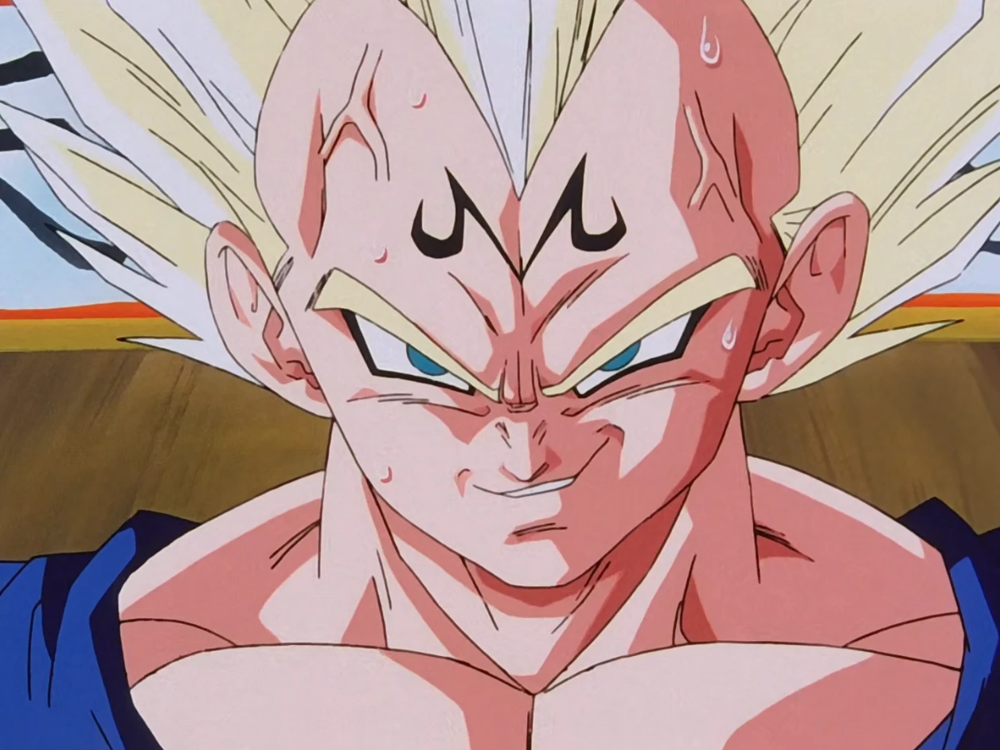

# Vegeta

## Overview
Vegeta is a prominent character in the **Dragon Ball** series created by Akira Toriyama. He is the prince of the Saiyan race and is known for his pride, fierce rivalry with Goku, and complex character development throughout the series.

## Character Profile

- **Full Name:** Vegeta
- **Race:** Saiyan
- **Occupation:** Prince of the Saiyan race, fighter

## Appearance
Vegeta is often recognized by his spiky black hair, muscular build, and distinct battle armor. His outfit typically consists of a blue jumpsuit with white gloves and boots, along with a white chest plate.

## Personality
Vegeta is characterized by his arrogance, competitiveness, and desire for power. Initially introduced as a villain, he undergoes significant development, eventually becoming an ally to Goku and the Z Fighters. His pride as a Saiyan drives him to constantly seek improvement and surpass Goku, his greatest rival.

## Abilities
Vegeta possesses a variety of powerful abilities, including:

- **Super Saiyan Transformation:** Increases strength and speed.
- **Galick Gun:** A powerful energy attack.
- **Final Flash:** A devastating energy beam.
- **Spirit Breaker:** A technique that combines his ki with a physical attack.
- **Instant Transmission:** Allows him to teleport instantly.

## Notable Story Arcs
- **Saiyan Saga:** Vegeta arrives on Earth seeking the Dragon Balls and battles Goku.
- **Frieza Saga:** He confronts Frieza, revealing the tragic fate of the Saiyan race.
- **Majin Buu Saga:** Vegeta struggles with his darker side but ultimately redeems himself.
- **Dragon Ball Super:** Vegeta participates in the Tournament of Power, showcasing his growth and teamwork.

## Relationships

### **[Trunks](Trunks.md)** his son

### **[Bra/Bulla](bra.md)** his daughter

### **[Goku](goku.md)** his rival

##

### Back to **[Main](mainfile.md)**

